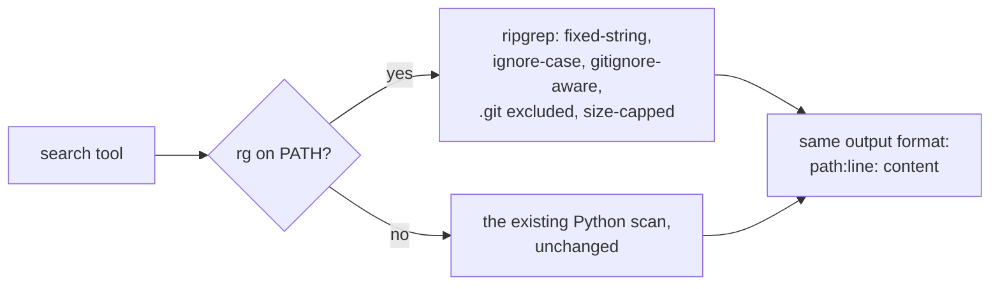

# Ripgrep-Backed Workspace Search

**Status:** Design accepted · **Phase:** Agent Tools follow-up (the "ripgrep
upgrade pending" note from Phase 1) · **Written:** 2026-07-17

## Why

The agents' plain-text `search` tool walks the whole workspace in Python,
reading every file line by line — correct, but slow on real repositories
(and it happily wades through `node_modules`). The benchmarks recorded this
caveat honestly; ripgrep is the standard answer.

## How

- **Same tool, same contract.** The output format (`path:line: content`,
  capped at 50 results, 200 chars a line), the empty-result message, and
  the jail on the search path are identical on both engines — the tests
  assert one expected string and pass either way.
- **ripgrep when available** — fixed-string, case-insensitive, hidden files
  included but `.git` excluded, per-file size cap matching the Python
  scan's. One deliberate improvement: ripgrep respects `.gitignore`, so
  vendored dependencies and build output no longer drown the results.
- **The Python scan stays as the fallback** — no new hard dependency; a
  machine without `rg` behaves exactly as before.

## Boundaries

- No regex exposure to the agents — the tool stays plain-text
  (fixed-string) on both engines; `search_code` remains the
  meaning-based arm.
- The gitignore-awareness difference between engines is accepted and
  documented rather than papered over with `--no-ignore`.
