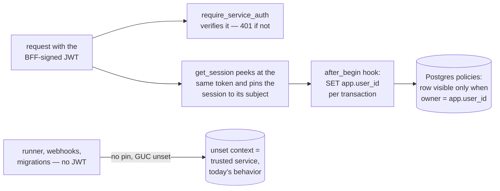

# Row-Level Security

**Status:** Design accepted · **Phase:** 7 — Production Hardening · **Written:** 2026-07-14

## Why

Every engine API is owner-scoped: a query filters by the caller's user id, and
someone else's resource returns 404. That protection lives entirely in
hand-written `WHERE` clauses — one forgotten filter in one route and another
user's runs, conversations, or **encrypted provider keys** leak. Defense in
depth means the database itself must refuse to hand over rows that do not
belong to the caller, even when the query forgets to ask.

PostgreSQL row-level security does exactly that: a policy attached to the
table decides row-by-row what a session may see and write, no matter what SQL
the application sends.

## How it works

- **Policies live on the five tables that carry ownership directly** —
  `repositories` (`owner_id`) and `conversations`, `agent_runs`,
  `provider_keys`, `integration_connections` (`user_id`). Each gets
  `ENABLE` **and** `FORCE` row level security: `FORCE` matters because the
  engine connects as the table owner, and owners bypass RLS without it.
- **A row is visible/writable when** `app.user_id` (a transaction-local GUC)
  equals the ownership column — **or when the GUC is unset**, which is the
  trusted internal context. The single source of truth for the policy SQL is
  `engine/db/rls.py`; the Alembic migration freezes a copy in time, and the
  test suite applies the living version.
- **Pinning is automatic, not per-route.** `get_session` peeks at the same
  bearer token `require_service_auth` verifies and stores the subject on the
  session; a SQLAlchemy `after_begin` hook applies
  `set_config('app.user_id', …, true)` at the start of **every** transaction.
  Transaction-local scope means nothing leaks back into the connection pool,
  and re-applying on every begin means a mid-request commit cannot drop the
  pin. Streaming endpoints pass the user to `session_scope(user_id=…)`
  explicitly.
- **Strictly additive.** Sessions that set no context — the agent runner,
  startup recovery, webhooks (verified by HMAC signature, not a user JWT),
  Alembic data migrations — behave exactly as before. The seam where bugs
  actually happen, hand-written route queries against a user-pinned session,
  is now guarded by Postgres.
- **The engine role must not be a superuser** — superusers bypass RLS no
  matter what, `FORCE` included (discovered the honest way: the policies
  passed every inspection and filtered nothing). Postgres also refuses to
  demote its bootstrap user, so the dev compose bootstraps as `postgres` and
  an init script creates `asep` as a plain `NOSUPERUSER CREATEDB` role owning
  its database (`infra/docker/postgres-init/`); CI mirrors this with a psql
  step. One knock-on: pgvector is not a *trusted* extension, so the init
  script installs it into `template1` as the superuser — every database
  created afterwards (dev, `asep_test`, backup-test scratch databases)
  inherits it, and the engine's `CREATE EXTENSION IF NOT EXISTS vector`
  becomes a no-op. The RLS test suite fails loudly with a rebuild hint if it
  ever finds itself running as a superuser.

## Exit criterion

With the policies applied (the whole test suite runs under `FORCE ROW LEVEL
SECURITY`), a session pinned to user B — issuing raw SQL with **no `WHERE`
filter at all** — reads only B's rows, updates zero rows of A's even when
targeting them by primary key, and gets a policy violation when inserting a
row that claims to belong to A. And the full existing suite stays green,
proving no code path silently depended on cross-user reads.

## Honest boundaries

- **Unset context is trusted.** A session that never pins sees everything —
  that keeps the runner, webhooks, and migrations working unchanged, but it
  means RLS guards the API seam, not a compromised engine process. True
  deny-by-default needs a separate, non-owner database role for the API and
  an explicit service context for internal paths — logged in the backlog.
- **Child tables are guarded through their parents.** `messages`,
  `agent_tasks`, `agent_events`, `code_chunks`, `work_items` carry no
  ownership column; the API reaches them only after an owner check on the
  parent. Subquery policies (`EXISTS (SELECT 1 FROM agent_runs …)`) can pin
  them down too, at a per-row planning cost — a follow-up, not this slice.
- **Organization-aware sharing is not this.** These policies enforce the
  *current* model (every resource has one owning user). Sharing a repository
  with an organization needs `org_id` columns, better-auth membership reads,
  and the organization switcher UI — that remains on the backlog as its own
  slice, and these policies are where its `org_id IN …` clause will land.
