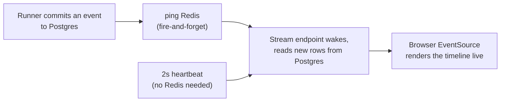

# Run Event Streaming

Design note for *Agent Runtime — run event bus* (a Phase 1 leftover; ADR-0004
chose Redis for this). Plain language; the task list lives in
[BACKLOG.md](../BACKLOG.md).

## The problem

The run page asks "anything new?" every 1.5 seconds — for every open run, for
the whole life of the run. Most of those requests come back empty. Streaming
turns this around: the browser opens one connection and the engine pushes each
timeline event the moment it lands.

## The design: Postgres is the record, Redis is the doorbell

Events already live in `agent_events`, whose bigint identity id gives a total
order and a resume cursor (that column was designed for exactly this —
AGENT_RUNTIME.md). So the stream never sends anything Redis carries; Redis only
*wakes it up*:

- **Publish** (`engine/events/bus.py`): after committing timeline events, the
  runner pings the run's Redis channel. Publishing never raises — if Redis is
  down, the ping is dropped and the log says so once.
- **Stream** (`GET /v1/runs/{id}/events/stream`): sends the backlog after the
  client's cursor, then waits for a ping *or* a 2-second heartbeat, re-reads
  Postgres, and pushes whatever is new. When the run reaches a terminal state
  and the backlog is drained, an `end` event closes the stream. A run waiting
  for approval keeps its stream open — `EventSource` auto-reconnects on close,
  so ending a merely-paused stream would loop reconnects; an idle open stream
  costs the same as the old polling.
- **Resume**: each SSE message carries its event id; a reconnecting
  `EventSource` sends `Last-Event-ID` and the stream picks up exactly where it
  left off. The `after` query parameter does the same for a fresh start.

Losing a ping therefore costs at most two seconds of latency — never an event.
With Redis healthy, events arrive the moment they commit. The polling endpoint
(`GET /v1/runs/{id}/events`) stays: it is the fallback and the tests' friend.

## The web side

The run page swaps its event polling for one `EventSource` through a BFF proxy
route (the chat SSE pattern). Each pushed event also nudges a throttled
re-fetch of the run detail, so the task board updates with the timeline. If the
stream errors, the page falls back to the old polling loop — worse latency,
same behavior.

## Boundaries

- Redis carries no payloads, only wake-ups — there is nothing to replay, no
  ordering to get wrong, and nothing is lost when Redis restarts.
- One stream per open run page; no fan-out registry in the engine. Each stream
  holds no database connection while it waits (a session per drain, not per
  stream).
- The event bus is for the run timeline only. Chat streaming already works
  token-by-token over its own SSE response and does not change.
