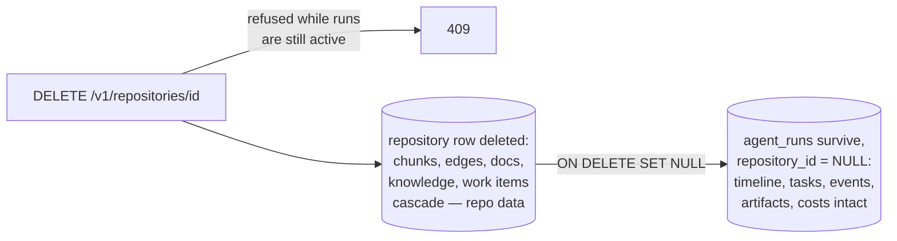

# Run-History Retention

**Status:** Design accepted · **Phase:** debt-register item ("before any
hosted deployment") · **Written:** 2026-07-18

## Why

`agent_runs.repository_id` carried `ON DELETE CASCADE`: deleting a
repository row silently erased every run made on it — timelines, task
boards, tool-call audit trails, costs. Run history is the platform's audit
record of what the agents did and what it cost; a disconnect must not be
able to destroy it. (There was also no way to disconnect a repository at
all — the missing endpoint and the wrong cascade were two halves of the
same gap.)

## The rule

> Deleting a repository removes the *repository's* data. It never removes
> the *runs'* data.

- **The FK becomes `SET NULL`** — a run outlives its repository with its
  timeline, task board, audit events, and cost totals intact; the runs list
  shows "(repository disconnected)" where the URL was.
- **Disconnect exists now** — `DELETE /v1/repositories/{id}`, same
  visibility scoping as every repository call (org members may disconnect a
  shared repository — equal collaborators). The repositories page gets a
  disconnect action.
- **Refused while runs are active** — queued/planning/awaiting-approval/
  executing/reviewing runs pin their repository (`409`); the runner never
  observes a vanished repository mid-flight.
- **Repository-scoped data goes with the repository** — code chunks,
  edges, indexed files, work items, knowledge, generated documents are
  derived from or about the repo; they cascade as before.

## Boundaries

- No soft-delete/undo for the repository itself — reconnecting the same URL
  is a fresh row (and a fresh index).
- No retention *schedule* (auto-pruning old runs) — nothing is deleted
  automatically; that policy can come with hosted multi-tenancy.
- The benchmark harness deletes its synthetic runs explicitly now that the
  cascade no longer does it.

## Deleting a run explicitly (2026-07-23)

Retention protects run history from *accidental* loss; a user still needs to
remove a run *on purpose* — a failed experiment, a test run, clutter.
`DELETE /v1/runs/{id}` does that, owner-scoped through the same `_visible_run`
check as the rest of the runs API (missing and not-yours both 404). Two
safeguards:

- **Never mid-flight.** The run must not be in an actively-working state
  (`queued`, `planning`, `executing`, `reviewing`) — deleting the row out from
  under a running background task would be a race; those return **409**. An
  awaiting-approval, completed, failed, or cancelled run is safe.
- **Everything goes together.** The run's tasks, events, and artifacts cascade
  in the database (the FKs the retention work left as `CASCADE` on the run's own
  children), and the on-disk workspace is removed. The run page's **Delete run**
  button appears only for a deletable run and returns to the list afterward.
