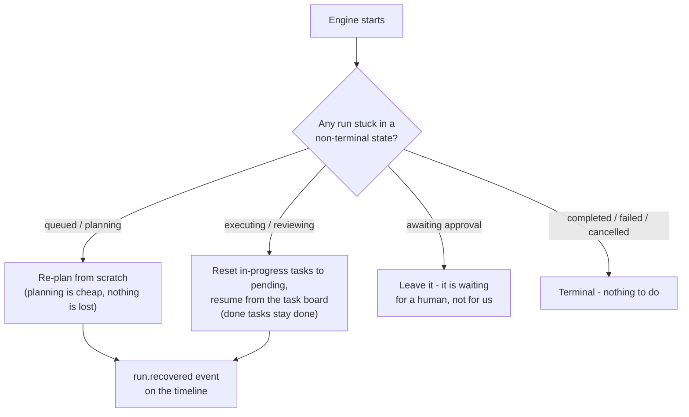

# Run Recovery

Design note for *Agent Runtime — Postgres checkpointing per run* (a Phase 1
leftover). Plain language; the task list lives in [BACKLOG.md](../BACKLOG.md).

## The problem

A run executes as a background task inside the engine process. If the engine
restarts mid-run — a deploy, a crash, a laptop reboot — that task simply
vanishes. The run's row stays frozen at `planning` or `executing` forever, the
UI shows a spinner that never stops, and the work is lost even though most of
it survived: the plan, the task board, and every status change already live in
Postgres, and the run's git workspace is still on disk.

## The insight: the checkpoint already exists

We don't need a new checkpointing system. The `agent_tasks` board **is** the
checkpoint — every task's status is written to Postgres the moment it changes,
and the Supervisor already routes by reading that board (done tasks are never
re-run). The workspace with all committed work survives on disk. The only
missing piece is someone noticing an interrupted run at startup and pressing
"continue".

## What recovery does, state by state

| State at startup | Action | Why |
|---|---|---|
| `queued`, `planning` | delete the half-made workspace, plan again | no approved plan exists yet, so nothing of value is lost; a fresh plan is cheaper than untangling a half-written one |
| `executing` | reset `in_progress` tasks to `pending`, resume | done tasks keep their commits in the workspace; only the interrupted task repeats |
| `reviewing` | resume the execution pipeline | the Supervisor sees every task done and falls straight through to review, then the gates, then the pull request |
| `awaiting_approval` | nothing | the run is waiting on a person; the workspace is on disk and approval works exactly as before |
| terminal states | nothing | the run already ended |

Every recovered run gets a `run.recovered` timeline event saying which state it
was found in, so a resumed run is never silently different from an untouched one.

## Boundaries

- Recovery runs **once at engine startup** (`RUN_RECOVERY_ENABLED`, on by
  default; tests turn it off and call recovery directly). It is not a watchdog —
  a run that hangs while the engine stays up is the budget guard's problem.
- Recovered runs execute sequentially in a background task, so a restart with
  many interrupted runs does not stampede the model provider.
- If the workspace is gone (the directory was deleted between restarts), the
  resumed run fails with that reason on the timeline — recovery never invents
  lost state.
- A restart *during* recovery is fine: recovery itself only moves runs between
  the same checkpointed states, so the next startup just picks them up again.
