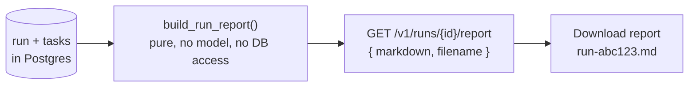

# Run Report — a shareable record of what the team did

**Status:** Design accepted · **Phase:** 8 follow-up · **Written:** 2026-07-22

## The problem

A finished run leaves a lot behind — a plan, a task board, a diff, a pull
request, a timeline of events — but nothing you can *hand to someone*. To tell a
teammate "here's what the AI team did on this feature", you'd screenshot the run
page or paste the PR link and hope the context travels. The run already holds
everything needed for a one-page summary; it just never assembles one.

## The design

`GET /v1/runs/{id}/report` returns a plain-English **markdown** document built
from the run record — the request, the plan summary, each task and its outcome,
the cost, and the result (the pull request, or the failure). The web run page
gets a **Download report** button that saves it as `run-<id>.md`.

- **Pure and offline.** `engine/reporting.py::build_run_report(run, tasks,
  repo_url)` is a pure function over the run and its tasks — no model call, no
  network, no database access of its own. So it works with `LLM_FAKE=1`, is
  trivially unit-tested, and never adds cost or latency.
- **Built from the record, not the workspace.** The report reads the run row and
  its task rows, which survive even after the workspace is cleaned up or the
  repository is disconnected — a report is available for *any* run, in any state.
- **Defensive about state.** A run that failed in planning has no tasks and no
  cost; the builder reads unset fields as empty/zero rather than crashing, so the
  same function serves a completed run and a half-finished one.
- **Owner-scoped like every run route.** The endpoint loads the run through the
  same `_visible_run` check the rest of the runs API uses — missing and
  not-yours both return 404.

## Honest boundaries

- **A summary, not a transcript.** The report captures the plan and each task's
  result line, not the full reasoning trace or the diff. The diff endpoint and
  the timeline (including `agent.reasoning`, AGENT_REASONING_TIMELINE.md) remain
  the place to go deep.
- **Markdown only.** No PDF/HTML rendering — markdown travels everywhere (chat,
  issues, wikis) and needs no dependency. A richer export is a later option.
- **Generated on request.** The report is not stored; it is rebuilt from the
  live record each time, so it always reflects the run's current state.
