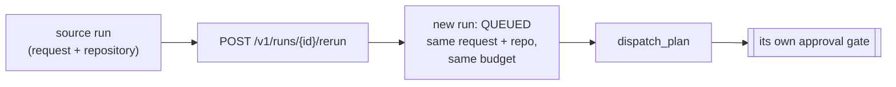

# Run Again — starting a fresh run from an old one

**Status:** Design accepted · **Phase:** 8 follow-up · **Written:** 2026-07-25

## The problem

A run captures a request against a repository. You often want to do it *again* —
a run failed on a transient error and you want to retry, or the code has moved on
and you want the same feature request re-run against the current `main`. Today
that means going back to the runs list, re-typing the request, and re-pasting the
repository URL. The old run already holds both.

## The design

`POST /v1/runs/{id}/rerun` starts a **new, independent** run from an existing
one's request and repository. The run page gets a **Run again** button that calls
it and navigates to the fresh run.

- **A fresh, independent run.** The endpoint reads the source run through the
  same `_visible_run` owner/org check the rest of the API uses, then creates a
  brand-new `AgentRun` — same request, same `repository_id`, same
  `max_cost_usd` — at `QUEUED`, and dispatches planning exactly like `POST
  /v1/runs`. It reuses no plan, tasks, events, or workspace; the new run gets its
  own plan and its own human approval gate.
- **It belongs to whoever re-runs it.** The new run's `user_id`/`org_id` are the
  actor's, not the source's — re-running an org-shared run makes *your* run, the
  same rule new runs already follow.
- **The repository must still be connected.** If the source run's repository has
  since been disconnected (`repository_id` dangling), there's nothing to run
  against, so the endpoint returns **409** with a plain reason rather than
  guessing a URL. History keeps the old run regardless (RUN_HISTORY_RETENTION.md).

## Boundaries

- **Not a resume.** This does not continue the old run from where it stopped or
  reuse its workspace — it starts clean. Resuming an interrupted run is a
  different mechanism (RUN_RECOVERY.md).
- **Request and repository only.** It does not copy a hand-edited plan or a
  budget override made mid-run; it re-runs the *ask*, and planning happens fresh.
  Re-running with an edited request is just the normal new-run form.
