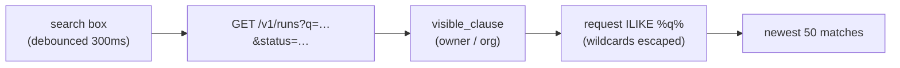

# Searching Runs by What You Asked For

**Status:** Design accepted · **Phase:** 8 follow-up · **Written:** 2026-07-24

## The problem

The runs list shows the 50 most recent runs, filterable by status. But the one
thing you actually remember about a past run is *what you asked it to do* —
"the run where I added the export endpoint". With a page of runs and no text
search, finding it means scrolling and reading every request line. The status
filter narrows by lifecycle; it can't find a run by its intent.

## The design

`GET /v1/runs` gains an optional `q` — a case-insensitive substring match on the
run's request text — that composes with the existing `status` filter and the
owner/org visibility rule.

- **Composes, doesn't replace.** `q` is `AND`-ed onto the same statement that
  already carries the visibility clause and the optional `status` filter, then
  the existing `created_at DESC` / `LIMIT 50`. Search never widens what a
  principal can see — it only narrows within it.
- **Literal search, not a pattern.** The query is matched with `ILIKE`, but the
  user's `%`, `_`, and `\` are escaped first (with an explicit `escape="\\"`), so
  a request containing `100%` searches for the literal text, not a wildcard. A
  blank or whitespace-only `q` is ignored — the same no-op as a missing filter.
- **Debounced at the edge.** The search box waits 300ms after the last keystroke
  before it fetches, so typing doesn't fire a request per character. The BFF
  forwards only the two known params (`status`, `q`); nothing else passes through.

## Boundaries

- **Request text only.** It searches the request — the thing you wrote and
  remember. Searching plan summaries, task titles, or timeline text is a richer
  full-text feature (a `tsvector` index) left for later; a substring match on the
  request covers the common "find my run" case without new schema.
- **Substring, not ranked relevance.** Matches come back newest-first, like the
  unfiltered list — not scored by how well they match. Good enough to locate a
  run; ranking is a later refinement if the list grows past a page of matches.
