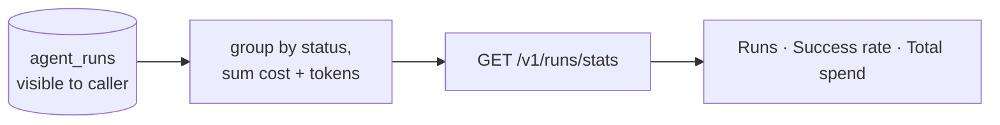

# Run Statistics — the product KPI, finally measured

**Status:** Design accepted · **Phase:** 8 follow-up · **Written:** 2026-07-23

## The problem

The platform's whole point is that agent runs *succeed* — yet nothing measured
how often they did. Individual runs each carry a status and a cost, but there
was no aggregate: how many runs has this user (or organization) done, how many
completed vs failed, and how much have they spent? Success/failure rate is the
single most important product signal, and it was invisible.

## The design

`GET /v1/runs/stats` aggregates the caller's *visible* runs (owner- and
org-scoped through the same `visible_clause` the runs list uses) into one small
JSON summary; the runs page shows it as a three-stat strip.

- **One grouped query.** A single `GROUP BY status` with `SUM(cost)` and
  `SUM(tokens)` over the visible runs; the derived fields (total, success rate,
  completed/failed) are computed from the grouped rows in Python. No per-run
  loop, no N+1.
- **Success rate is terminal-only.** `completed / (completed + failed)` —
  in-flight runs (queued, planning, executing, awaiting approval) don't count
  for or against it, and with no terminal runs yet the rate is `null` (shown as
  "—") rather than a misleading 0%.
- **Scoped like every run route.** The same `visible_clause` means a user sees
  their own runs, an active organization folds in its shared runs, and nothing
  leaks across owners.

## Honest boundaries

- **No time series.** This is the current lifetime aggregate, not a trend over
  days. A windowed / charted version is a later refinement.
- **Cost is what the runs recorded.** Under `LLM_FAKE=1` that is zero, so the
  spend stat reads `$0.00` in offline dev — correct, if unexciting.
- **Not the same as OTel metrics.** The alerting cost metric
  ([ALERTING.md](ALERTING.md)) watches live spend for operators; this endpoint
  is the *user's* view of their own runs, read straight from Postgres.
