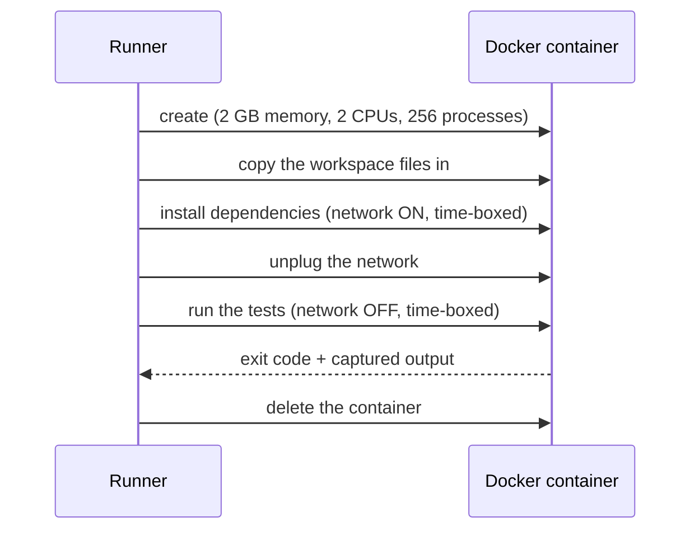

# Sandbox Execution

Phase 3 design note. Runs the code the agents wrote — build and tests — inside
a disposable Docker container before a pull request opens. Plain language; the
task list lives in [BACKLOG.md](../BACKLOG.md).

## The problem

Agents write code, a Reviewer reads it, but nothing *executes* it. A change can
look right in a diff and still not compile or fail its own tests. Running that
code directly on the host is not an option: it is machine-generated and must be
treated as untrusted (ADR-0008 allows no arbitrary shell on the host).

## The idea

A **sandbox** is a throwaway mini-computer made with Docker. The run's code is
*copied* in (never mounted, so nothing the tests do can touch the real
workspace), dependencies are installed, the network is unplugged, and the tests
run under hard limits. Whatever happens inside — pass, fail, or infinite loop —
the container is deleted afterwards and the host never notices.

Why the network is on for the install step only: `pip` and `npm` need the
internet to download packages — there is no way around that. The *tests* are
where agent-written code actually executes, so that phase runs with the network
disconnected: a malicious or buggy test cannot leak secrets or download
anything. The install phase runs known package managers against manifests the
diff scanner will also inspect (dependency scanning is a separate backlog item).

## What runs, exactly

`engine/sandbox/runner.py` looks at the workspace and picks a plan:

| Found in the workspace | Image | Install (network ON) | Test (network OFF) |
|---|---|---|---|
| `requirements.txt` | `python:3.12-slim` | `pip install -r requirements.txt pytest` | `python -m pytest -q` |
| `pyproject.toml` (a real package) | `python:3.12-slim` | `pip install . pytest` | `python -m pytest -q` |
| `pyproject.toml` (tool config only) | `python:3.12-slim` | `pip install pytest` | `python -m pytest -q` |
| `test_*.py` files only | `python:3.12-slim` | `pip install pytest` | `python -m pytest -q` |
| `package.json` with a `test` script | `node:20-slim` | `npm ci` (or `npm install`) | `npm test` |
| none of the above | — | — | sandbox is **skipped** |

Each phase has a time limit (`SANDBOX_TIMEOUT_SECONDS`, default 300 s). The
container gets 2 GB of memory, 2 CPUs, and a 256-process cap, and receives
**no environment variables from the host** — the engine's `.env` never enters
the sandbox. It also starts with every kernel capability dropped
(`--cap-drop ALL`) and privilege escalation blocked
(`--security-opt no-new-privileges`), and carries the label `asep.sandbox=1`
so an orphaned container (engine killed mid-run) can be found and removed:
`docker ps -aq --filter label=asep.sandbox | xargs docker rm -f`.

Plan detection is deliberately conservative: `package.json` is *parsed* (a
test script must really exist, not just the word "test" somewhere in the
file), and the search for bare `test_*.py` files skips `.git`,
`node_modules`, virtualenvs, and build output so vendored code cannot
trigger a run.

## Outcomes

| Status | Meaning | Effect on the run |
|---|---|---|
| `passed` | tests ran and exited 0 | proceed to the secrets gate |
| `failed` | tests failed, timed out, or Docker broke mid-run | run fails; no pull request |
| `skipped` | Docker not available, sandbox disabled, or no recognized test setup | proceed, with the reason recorded |

Every outcome lands in the run timeline as a `sandbox.run` event carrying the
status, the commands used, the exit code, and the tail of the output — so the
run page can show *why* tests failed.

Skipping when Docker is missing keeps offline development working; the event
makes the skip visible instead of silent. A leaked secret still cannot slip
through — the secrets gate runs after the sandbox either way. For production,
set `SANDBOX_REQUIRED=1`: then a missing Docker daemon **fails** the run
instead of skipping, so the gate can never be waved open by turning Docker
off.

## Where it sits in the run today

Engineers finish → Reviewer approves → **sandbox tests** → secrets gate → pull
request. The tests therefore run against the final code, revisions included.
When the QA agent ships (next slice), the sandbox moves earlier and failures
route back to the engineers for a bounded number of fixes instead of failing
the run outright.

## What this slice does not do

- No QA self-correction loop yet — a test failure fails the run.
- No per-repository custom images or commands — the table above is the whole
  detection logic.
- No dependency vulnerability scanning — separate backlog item in the Security
  Scanning workstream.
