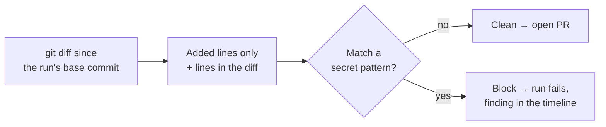

# Secrets Scanning

Phase 3 design note. Plain language; the task list lives in
[BACKLOG.md](../BACKLOG.md). Part of [EXECUTION_AND_QA.md](EXECUTION_AND_QA.md).

## The idea

The agents open pull requests automatically. If a change accidentally hard-codes
an API key or a private key, that secret would be pushed to GitHub — where it is
effectively public forever. So before a run opens its pull request, we scan
**what the run added** and, if a secret is found, block the pull request and fail
the run with a clear reason.

## What it scans

Only the **added lines** of the run's diff (`git diff <base_sha>`), because we
care about what this run introduces — not code that already lived in the
repository. Each added line is matched against a small set of high-confidence
patterns:

- Cloud keys — AWS access key ids (`AKIA…`), Google API keys (`AIza…`).
- Version-control and chat tokens — GitHub (`ghp_…`, `github_pat_…`), Slack
  (`xox…`).
- Payment keys — Stripe live secret keys (`sk_live_…`).
- Private keys — any `-----BEGIN … PRIVATE KEY-----` block.
- Labelled assignments — a `password` / `secret` / `token` / `api_key` assigned a
  quoted literal, unless the value is an obvious placeholder (`example`,
  `changeme`, `<...>`, `${...}`, `os.environ[...]`, `process.env...`).

The patterns are deliberately conservative: a real secret scanner (e.g.
gitleaks) has hundreds of rules, but a handful of precise ones catch the common
leaks with almost no false positives, and the set is a single table that is easy
to extend.

## What happens on a hit

The scanner returns findings — rule name, file, line number, and a **redacted**
snippet (the raw secret is never stored or logged). The runner:

1. emits a `security.scan` event to the run timeline (blocked = true, plus the
   redacted findings), and
2. fails the run with a surfaced reason **before** pushing the branch or opening
   the pull request.

A clean scan emits the same event with `blocked = false` and the run continues to
open its pull request as before. Offline runs (`LLM_FAKE=1`) produce ordinary
code, so the scan passes and the pipeline still completes end to end.

## What this is not (yet)

Dependency vulnerability scanning is a separate Phase 3 item — it needs an
advisory source (a vulnerability database) to be meaningful, so it is tracked on
its own rather than faked here. Entropy-based detection of unlabelled random
strings is a later refinement; the current rules are pattern-based so their
behaviour is deterministic and testable offline.
