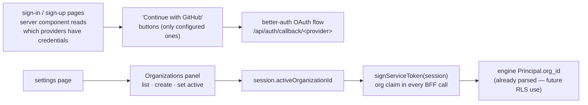

# Sign-in Providers & Organizations

Design note for the two Phase 1 leftovers: OAuth sign-in surfaced in the UI,
and the organization switcher. Together they finish the identity story
ADR-0007 planned — and the switcher is the prerequisite for org-aware
sharing in the row-level-security policies (logged Phase 7 follow-up).

## The problem

better-auth has supported GitHub/Google/Microsoft OAuth since Phase 0 — the
providers activate automatically when their env credentials exist — but the
sign-in page only ever showed the email+password form, so nobody could
actually use them. And the organization plugin's tables exist with no UI:
no way to create an organization, no way to switch into one, and the
`org` claim in the service JWT (`signServiceToken` has accepted an `orgId`
since ADR-0002) is never filled.

## Shape

## Decisions

- **The server decides which buttons exist.** The sign-in and sign-up pages
  become server components that read which providers have credentials (the
  same `env` checks `lib/auth.ts` makes) and pass a plain list to the client
  form. No secrets reach the client — just names — and an unconfigured
  provider shows no dead button.
- **Social sign-in doubles as sign-up.** Both pages show the same provider
  buttons; better-auth creates the account on first OAuth sign-in. The
  email+password form stays untouched.
- **Organizations live on the settings page.** A panel lists the user's
  organizations, creates one (name → slug), and sets the active one —
  better-auth's client hooks (`useListOrganizations`,
  `organization.setActive`) do the state work; the active organization is
  session state on the server, not a cookie we invent.
- **The service JWT carries the active organization automatically.**
  `signServiceToken` now takes the whole session and fills the `org` claim
  from `session.activeOrganizationId` — all 41 BFF call sites stop
  hand-passing the user id, and a future org-aware engine gets its claim
  without touching 41 routes again. The engine's `Principal.org_id` already
  parses it (unused until the RLS follow-up, by design).
- **GitHub OAuth app setup is documented, not automated.** The operator
  creates the OAuth app (callback:
  `<BETTER_AUTH_URL>/api/auth/callback/github`) and sets
  `GITHUB_CLIENT_ID/SECRET` — same pattern as every other integration.

## Exit criterion (this slice)

With GitHub credentials configured, the sign-in page shows "Continue with
GitHub" and completes the OAuth round-trip to /chat; without credentials the
button is absent. A signed-in user can create an organization on the
settings page and make it active; from then on every BFF-signed service JWT
carries that organization in its `org` claim (unit-tested against the token
itself). Web lint/typecheck/tests green.

## Boundaries (kept out of this slice)

- **No org-aware authorization yet** — the engine keeps scoping by owner;
  the `org` claim rides along unused until the RLS org-sharing follow-up
  (needs membership checks, policy changes, and its own design pass).
- **No invitations/members UI** — creating and switching is enough to
  unblock the RLS work; inviting teammates arrives with actual sharing.
- **No account linking UI** — first sign-in per provider creates a fresh
  account; linking an OAuth identity onto an email account is better-auth
  configuration left for later.
