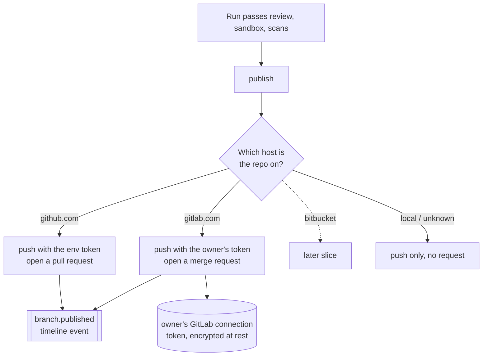

# Source Hosts

Phase 6 workstream (part of External Integrations). Plain language; the task
list lives in [BACKLOG.md](../BACKLOG.md).

## The problem

A finished run pushes its branch and opens a **pull request** — but only on
GitHub. Teams whose code lives on GitLab (or Bitbucket) get the branch push at
best and no merge request at all. The publish step hard-codes one host.

Source hosts make the publish step **host-aware**: detect where the repository
lives and open the right kind of request there — a GitHub pull request, a GitLab
merge request — using the credentials for that host. GitLab is the first new
host; Bitbucket reuses everything behind it.

## The design

The change is **strictly additive** — the GitHub path is untouched, so the
golden run is unchanged. `_publish` gains host detection and a GitLab branch
beside the existing GitHub one.

- **Host detection** — `parse_github_repo` already recognizes GitHub URLs;
  `parse_gitlab_repo` (in `engine/integrations/gitlab.py`) recognizes
  `gitlab.com` URLs and returns the project path (which can be nested,
  `group/subgroup/repo`). A URL that matches neither (a local path, an unknown
  host) publishes the branch only, exactly as before.
- **Credentials from the connection store** — GitHub keeps using the server's
  `GITHUB_TOKEN` (unchanged). GitLab uses the run owner's **encrypted GitLab
  connection** — the same per-user store as Slack/Linear/Jira
  ([EXTERNAL_INTEGRATIONS.md](EXTERNAL_INTEGRATIONS.md)): a `{token, base_url}`
  config, `base_url` defaulting to `https://gitlab.com`. GitLab is a connection
  kind but **not** an issue tracker, so it is never a work-item push target.
- **Push auth** — `push_branch` gained an optional credential. With none (the
  default) it keeps its GitHub-env behavior byte-for-byte; `_publish` passes an
  `("oauth2", token)` credential for a GitLab repo so the branch push
  authenticates. The token is redacted from any error the same way the GitHub
  token already is.
- **Merge request** — `open_merge_request` POSTs to
  `{base_url}/api/v4/projects/{url-encoded path}/merge_requests` with a
  `PRIVATE-TOKEN` header and returns the MR's `web_url`. Dry-run
  (`INTEGRATIONS_DRY_RUN=1`) returns a deterministic placeholder so the piece is
  testable offline.

## Exit criterion (this slice)

A run on a `gitlab.com` repository, with the owner's GitLab token connected,
pushes its branch to GitLab and opens a merge request, its URL recorded on the
run exactly like a GitHub pull request. GitHub runs are unchanged.

## Boundaries

- `gitlab.com` (SaaS) URL detection only; a self-hosted GitLab whose host is not
  `gitlab.com` is a later refinement (the connection already carries a
  `base_url` for the API, so it is a small step).
- Bitbucket is not implemented here — it is the next host behind the same seam.
- No two-way sync and no draft/reviewer/label options on the merge request —
  title, description, source and target branch only.
- GitLab credentials are per **user**, not per organization (same call as the
  other connections).
