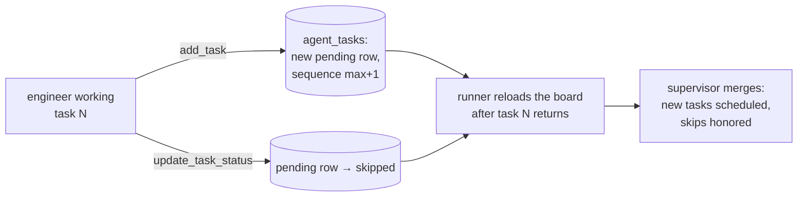

# Task-Board Agent Tools

**Status:** Design accepted · **Phase:** 1 leftover — Agent Tools workstream
· **Written:** 2026-07-16

## Why

The task board (`agent_tasks`) is the run's plan made visible — but until
now only the Product Manager (at planning time) and the runner (status
bookkeeping) could write it. An engineer who discovers necessary work
mid-task had exactly one bad option: silently widen its own diff. And a task
that turned out to be unnecessary got executed anyway, because nobody could
say so.

The registry has declared `update_task_status` (and a task-creation tool)
in the engineers' tool policies since Phase 1 — declarative names waiting
for implementations. This slice binds them.

## The two tools

| Tool | Who | What it does |
|---|---|---|
| `add_task` | Backend, Frontend, DevOps | Append a new **pending** task to this run's board (next sequence, no dependencies). The supervisor schedules it after the current task finishes. |
| `update_task_status` | Backend, Frontend, DevOps | Mark a **pending** task **skipped**, with a reason. That is the only transition agents get — every other status belongs to the runner and supervisor. |

## How the supervisor learns about board changes

The supervisor graph works over an in-memory board built once at execution
start. The tools write Postgres (durable, and the UI board sees the change
immediately) — the seam is the task executor:

- The runner's executor, after a task succeeds, reloads the run's rows and
  returns an `ExecutionOutcome`: the result summary, plus any **new** tasks
  and any **skipped** ids it found.
- The supervisor's execute node merges the outcome: new tasks join the
  board, skips flip in-memory pending tasks to skipped. Scheduling then
  proceeds as always — lowest eligible sequence first.
- Executors that return a plain string mean "no board changes"; the
  existing supervisor semantics (retries, deadlock detection, finalize)
  are untouched.

## Guardrails

- **Deny by default stands** — only the three engineer roles hold the
  tools; the Reviewer, QA, and the planners do not.
- **Skipping cannot deadlock the board.** A pending task that another
  unfinished task depends on cannot be skipped (eligibility requires
  dependencies *done*, so a skipped dependency would strand its dependents
  — the tool refuses instead).
- **Only pending tasks can be skipped** — the current task is in_progress,
  so an agent can never skip its own assignment.
- **The board is capped** (30 tasks per run): a looping agent cannot flood
  the run with work; the budget guard still bounds total spend either way.
- **New tasks take engineer roles only** — an agent cannot enqueue work
  for the reviewer or the planners.
- **Everything is audited**: `task.created` and `task.status_changed`
  events land on the timeline next to the usual `tool.called` audit row.

## Exit criterion

In a supervised run, a task's executor reports a newly added task and the
supervisor executes it within the same run; a pending task skipped by an
agent is never executed; skipping a task with unfinished dependents is
refused. The offline pipeline and every existing supervisor/tool test stay
green.

## Honest boundaries

- **New tasks carry no dependencies.** They are independent follow-ups that
  run in sequence order; dependency-linked insertion (and reordering) can
  come when a real run demonstrates the need.
- **`update_task_status` only skips.** Reopening done work, failing tasks,
  or reordering stays with the supervisor and the humans.
- **The Product Manager keeps its JSON plan contract** — the initial board
  is still created in one validated step at planning time, not through
  `add_task`.
