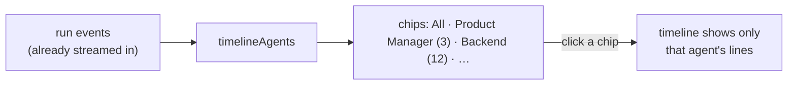

# Following One Agent on the Run Timeline

**Status:** Design accepted · **Phase:** 8 follow-up · **Written:** 2026-07-24

## The problem

A run's timeline is a single chronological stream. With nine roles taking turns
— the Product Manager plans, three engineers edit, the Reviewer judges — the
lines interleave. When you want to follow *one* agent ("what did the Backend
engineer actually think and do?"), you have to scan the whole list and pick its
lines out by eye. The more capable the team got — reasoning traces, tool calls,
board edits all now on the timeline — the noisier that single stream became.

## The design

A row of filter chips above the timeline lets you narrow it to one agent, the
same shape as the status chips on the runs list.

- **Client-side only.** The events are already in the page — streamed over SSE,
  each carrying its `agent` role (or `null` for run-level and human actions).
  Filtering is a `filter()` over the array we already hold; **no new endpoint, no
  new fetch, nothing added to the stream.**
- **One pure helper.** `timelineAgents(events)` returns the distinct agents that
  appear, in first-appearance order, each with its line count — so the chips read
  `Backend (12)` and are unit-testable in isolation. The run-level / human lines
  (null agent) collapse into a single **System** chip when present.
- **"All" is the default.** No chip selected shows the full stream, exactly as
  before; the chips only appear once the run has produced events, and only the
  agents that actually acted get a chip.
- **The live stream keeps flowing.** The filter is a view over the growing event
  list; new events still arrive and the chips' counts update. Selecting an agent
  never pauses or drops incoming events — deselect (or click **All**) and the
  full timeline is intact.

## Boundaries

- **A filter, not separate panes.** The backlog imagined per-agent output panes;
  a single filtered timeline gives the same "follow one agent" value for a
  fraction of the surface, and keeps chronological context one click away. Split
  side-by-side panes remain a later refinement if they earn their place.
- **Attribution is the event's own `agent`.** We don't re-derive who acted; we
  trust the role the engine stamped on each event. A line with no agent is a
  System line — correct for run lifecycle and human decisions.
