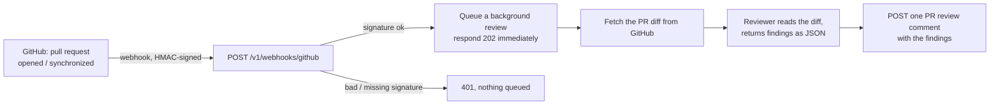

# Webhook Reviewer

Phase 3 design note. Plain language; the task list lives in
[BACKLOG.md](../BACKLOG.md). This is Phase 3 exit criterion 2: the review agent
comments on a webhook'd pull request within five minutes.

## The problem

The agent team reviews its *own* pull requests before opening them. But a human
teammate opens pull requests too, and those get no automated review. This
workstream points the Reviewer at **real** pull requests: GitHub notifies the
engine when a pull request is opened or updated, and the Reviewer reads the diff
and posts its findings as a review comment — no agent run involved.

## How it works

1. **GitHub sends a webhook** to `POST /v1/webhooks/github` on every
   `pull_request` event. The payload is signed with a shared secret
   (`GITHUB_WEBHOOK_SECRET`) as `X-Hub-Signature-256`.
2. **The engine verifies the signature** over the *raw* request body with
   HMAC-SHA256 and `hmac.compare_digest` (constant-time). A bad or missing
   signature is a `401`, and nothing is queued. If no secret is configured the
   endpoint rejects every call — it never accepts an unsigned payload.
3. **Only actionable events are queued.** `pull_request` events with action
   `opened`, `reopened`, or `synchronize` (new commits) trigger a review;
   everything else (labels, assignments, closes) is acknowledged and ignored.
4. **The review runs in the background** so the webhook returns `202` well
   inside GitHub's 10-second delivery timeout. The task fetches the PR's unified
   diff, hands it to the diff-based Reviewer, and posts the result as a single
   pull-request review with `event: COMMENT`.

The whole background path — one diff fetch, one model call, one comment POST —
finishes in seconds, comfortably inside the five-minute criterion.

## Why a review comment, not inline comments

GitHub inline comments must map each finding to an exact position in the diff; a
wrong position is a `422` and the whole review fails. To hit the exit criterion
reliably, the Reviewer posts **one review with a markdown body** that lists each
finding as `path:line — issue`. Inline, position-mapped comments are a later
refinement, not a blocker.

## Security

- The endpoint is **public** (GitHub is not the BFF, so it carries no service
  JWT) but **authenticated by the HMAC signature** — the one exception to
  "every `/v1/*` route needs the service JWT" (see CLAUDE.md), justified here.
- The signature is checked over the exact received bytes, before the JSON is
  trusted. `hmac.compare_digest` avoids leaking the secret through timing.
- Fail closed: an unconfigured secret rejects all webhook traffic.

## What this does not do yet

- No persistence: a webhook review is stateless (logged, not stored). Tying
  reviews to a database record is future work if an audit trail is needed.
- No per-repository secrets: one global `GITHUB_WEBHOOK_SECRET`, like
  `GITHUB_TOKEN` today. Per-user encrypted credentials are the Identity & Keys
  workstream.

## Settings

| Setting | Default | Meaning |
|---|---|---|
| `GITHUB_WEBHOOK_SECRET` | `""` | Shared secret GitHub signs webhooks with; empty rejects all webhook calls |
| `GITHUB_TOKEN` | `""` | Reused to fetch the PR diff and post the review comment |
