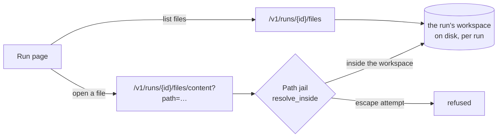

# Workspace Panels

Phase 6 workstream. Plain language; the task list lives in
[BACKLOG.md](../BACKLOG.md).

## The problem

The run page shows *what changed* (the colored diff) but not *the code around
it*. To understand a run you often want to open a file the agents didn't touch —
the module they imported, the test they were fixing, the config they read. Today
that means leaving the platform and opening the repository elsewhere.

Workspace panels bring the run's actual files onto the run page: a **file tree**
to browse the whole workspace and a **viewer** to read any file, as it stands in
that run. This first slice is **read-only**; an in-browser editor, git staging,
and a terminal are later work.

## The design

Everything needed already exists; the panels are a thin read-only layer.

- **The workspace is still there.** A run's workspace lives at
  `.workspaces/<run>` and is removed only when a plan is *rejected* (or a
  queued/planning run is recovered). A completed run keeps its files — the diff
  endpoint already reads them live — so the browser reads the same directory and
  returns a graceful "workspace is gone" `404` when it does not.
- **The jail is the security boundary.** Every path the browser is asked to open
  goes through `resolve_inside` (`engine/workspace/jail.py`, ADR-0008) — the same
  jail the agent tools use — so a `..`, an absolute path, a symlink, or a UNC
  path can never read outside the run's workspace. `.git` is hidden, like the
  agents' `list_dir`.
- **Two endpoints, both owner-scoped** (like the diff):
  - `GET /v1/runs/{id}/files` — the workspace's files as a flat, sorted list of
    `{path, size}` (capped; the tree is built client-side by splitting paths).
  - `GET /v1/runs/{id}/files/content?path=…` — one file's text, size-capped, with
    a `truncated` flag; a jail violation is a `400`, a missing file a `404`.
- **The run page** gains a Files section: the file list on one side, the selected
  file's content in a viewer. It loads once the run has a workspace and sits
  beside the existing diff and timeline.

## Exit criterion (this slice)

On a run that has a workspace, the run page lists the workspace's files and opens
any one of them read-only; a path that tries to escape the workspace is refused.

## Boundaries (kept out of this slice)

- **Read-only.** No in-browser editing, no git staging/commit panel, no file
  create/rename/delete — those write to the workspace and need their own care.
- **No terminal.** A terminal means running commands, which is the arbitrary-shell
  boundary ADR-0008 draws at the Phase 3 sandbox; it is deliberately deferred.
- Binary files are returned as best-effort decoded text (`errors="replace"`); a
  proper binary/image viewer is later polish.
- The file list is capped; a very large workspace shows the first N files with a
  "truncated" marker rather than an unbounded payload.
