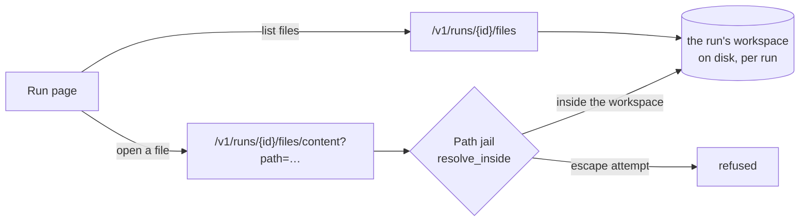

# Workspace Panels

Phase 6 workstream. Plain language; the task list lives in
[BACKLOG.md](../BACKLOG.md).

## The problem

The run page shows *what changed* (the colored diff) but not *the code around
it*. To understand a run you often want to open a file the agents didn't touch —
the module they imported, the test they were fixing, the config they read. Today
that means leaving the platform and opening the repository elsewhere.

Workspace panels bring the run's actual files onto the run page: a **file tree**
to browse the whole workspace, a **viewer/editor** to read or change any file,
and a **git panel** to see what changed and commit it. A terminal is later work.

## The design

Everything needed already exists; the panels are a thin read-only layer.

- **The workspace is still there.** A run's workspace lives at
  `.workspaces/<run>` and is removed only when a plan is *rejected* (or a
  queued/planning run is recovered). A completed run keeps its files — the diff
  endpoint already reads them live — so the browser reads the same directory and
  returns a graceful "workspace is gone" `404` when it does not.
- **The jail is the security boundary.** Every path the browser is asked to open
  goes through `resolve_inside` (`engine/workspace/jail.py`, ADR-0008) — the same
  jail the agent tools use — so a `..`, an absolute path, a symlink, or a UNC
  path can never read outside the run's workspace. `.git` is hidden, like the
  agents' `list_dir`.
- **Two endpoints, both owner-scoped** (like the diff):
  - `GET /v1/runs/{id}/files` — the workspace's files as a flat, sorted list of
    `{path, size}` (capped; the tree is built client-side by splitting paths).
  - `GET /v1/runs/{id}/files/content?path=…` — one file's text, size-capped, with
    a `truncated` flag; a jail violation is a `400`, a missing file a `404`.
- **The run page** gains a Files section: the file list on one side, the selected
  file's content in a viewer. It loads once the run has a workspace and sits
  beside the existing diff and timeline.

## Editing and committing (finished runs only)

The read-only browser became a light editor once the run is done. Three write
endpoints, all owner-scoped and jailed like the reads:

- `PUT /v1/runs/{id}/files/content` — replace one file's content (parent folders
  created, like the agents' `write_file`).
- `GET /v1/runs/{id}/git-status` — the working tree's changes (`git status
  --porcelain`, one `{path, code}` per line) so the panel shows what was edited.
- `POST /v1/runs/{id}/commit` — stage everything and commit with a message
  (`git add -A` then commit); an empty working tree is a `400`.

The crucial guard: **writes are refused unless the run is finished**
(`completed` or `failed`). While a run is queued, planning, executing, or
reviewing, the agent loop owns the workspace — a human write then would race it —
so those states get a `409`. A finished run's workspace is idle, so a human can
safely make a manual fix and commit it.

## Pushing the branch *(added 2026-07-16)*

A manual commit used to be stranded: it lived in the local workspace while the
pull request showed the agents' last push. One endpoint closes the loop:

- `POST /v1/runs/{id}/push` — push the run's branch to its host, exactly the
  way the run pipeline publishes (`push_branch`): a GitLab repository uses the
  **run owner's** encrypted GitLab connection, GitHub uses the environment
  token, anything else pushes plainly. Finished runs only (the same `409`
  guard as writes); a scratch workspace with no remote is a `400` with a
  plain-language reason. Every push lands on the timeline as `branch.pushed`,
  recording the branch and who pressed the button.
- The git panel gains a **Push branch** button next to Commit: commit your
  manual fix, push it, and the run's existing pull request updates — no
  leaving the platform.

If the run belongs to an organization, any member can push (members are equal
collaborators — ORGANIZATION_SHARING.md); the credential used is always the
run owner's and never leaves the server.

## Exit criterion

On a run that has a workspace, the run page lists the workspace's files and opens
any one; a path that tries to escape the workspace is refused. On a *finished*
run, a file can be edited, the change committed, and the branch pushed back to
the host; editing an in-flight run is refused.

## Boundaries (kept out)

- ~~No terminal~~ — *shipped 2026-07-19 as its own slice*: a sandboxed
  command console that goes **through** ADR-0008's boundary, not around it
  ([IN_BROWSER_TERMINAL.md](IN_BROWSER_TERMINAL.md)).
- **Push updates the branch, never opens a pull request.** A finished run
  either already has its PR (the push updates it) or the pipeline chose not
  to open one — that decision is not re-made by hand here.
- **No file create/rename/delete** from the tree, and no writes to an in-flight
  run (the agent loop owns it then).
- Binary files are returned as best-effort decoded text (`errors="replace"`); a
  proper binary/image viewer is later polish.
- The file list is capped; a very large workspace shows the first N files with a
  "truncated" marker rather than an unbounded payload.
