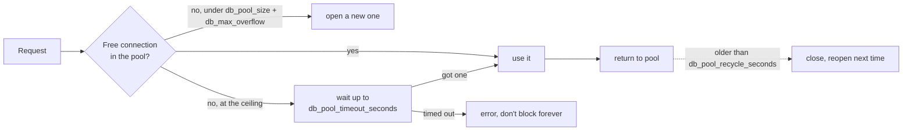

# Connection Pool Sizing

Phase 7, Hardening-the-Seams workstream. Plain language; the task list lives in
[BACKLOG.md](../../BACKLOG.md).

## The problem

Every request borrows a database connection from a pool and returns it when it
is done. A streaming run holds its connection for the whole run, not a few
milliseconds — so a handful of concurrent runs can hold every connection at
once and the next request waits. The pool was left at SQLAlchemy's defaults (5
kept open, 10 more under load), which is small for that shape of work, and
connections were never recycled — so a socket that a proxy or the database
quietly dropped could be handed back dead.

## The design

- **A sized pool that overflows under load.** Each engine keeps
  `DB_POOL_SIZE` connections open and opens up to `DB_MAX_OVERFLOW` more when
  they are all busy. A replica's ceiling is therefore
  `DB_POOL_SIZE + DB_MAX_OVERFLOW` connections **per engine**.
- **Recycled connections.** After `DB_POOL_RECYCLE_SECONDS` a returned
  connection is closed and reopened on next use, so a proxy or database
  idle-timeout never leaves a dead socket in the pool. `pool_pre_ping` is the
  belt to that suspenders — it checks a connection is alive before handing it
  out — but recycling means the check almost never has to reject one.
- **A bounded wait, not a hang.** When every connection is checked out, a new
  request waits at most `DB_POOL_TIMEOUT_SECONDS` for one to free up, then
  raises. Slow is bad; hanging forever is worse.

## Two engines

With `DATABASE_URL_API` set (the privilege-separation mode in
[ROW_LEVEL_SECURITY.md](../ROW_LEVEL_SECURITY.md)) there are **two** engines —
the owner engine and the non-owner API engine — each with its own pool. So a
replica can open up to `2 × (DB_POOL_SIZE + DB_MAX_OVERFLOW)` connections.

## Boundaries

- **Keep the total under Postgres `max_connections`.** The real ceiling is
  `replicas × engines × (DB_POOL_SIZE + DB_MAX_OVERFLOW)`. At the defaults
  (10 + 20) that is 30 per engine, 60 per replica in two-role mode — size the
  database, or a connection pooler like PgBouncer, to match before scaling the
  replica count up.
- The two engines share one pool policy on purpose: one set of knobs to reason
  about. Per-engine sizing is a refinement once real traffic shows one pool
  runs hotter than the other.
