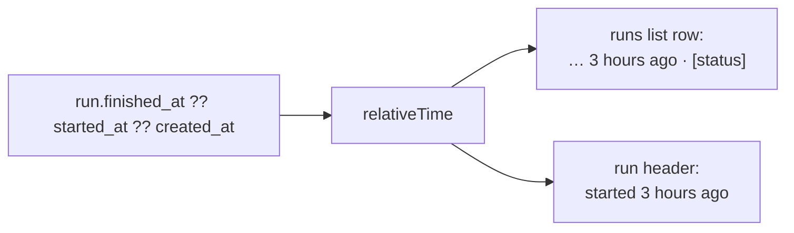

# When Did This Run Happen?

**Status:** Design accepted · **Phase:** 8 follow-up · **Written:** 2026-07-24

## The problem

The runs list shows each run's request and status, and the run page shows its
plan, cost, and result — but neither shows *when*. Two runs of the same feature
look identical in the list; you can't tell yesterday's attempt from one five
minutes ago, and the ordering (newest first) is the only time cue. The runs
already carry `created_at`, `started_at`, and `finished_at`; the UI just never
rendered them.

## The design

Reuse the `relativeTime` helper (from the repository index-freshness work,
[REPOSITORY_INDEX_FRESHNESS.md](../repository-intelligence/REPOSITORY_INDEX_FRESHNESS.md)) to show a coarse
"… ago" in two places.

- **The most meaningful moment.** A row shows the *finish* time when the run has
  finished, otherwise when it *started*, falling back to when it was *created* —
  `finished_at ?? started_at ?? created_at`. That's the one timestamp a reader
  actually wants: "this finished 3 hours ago".
- **The header spells the verb.** The run page header shows `started 3 hours ago`
  and, once finished, `· finished 2 hours ago`, so the detail view reads as a
  sentence while the list stays terse (time + status chip).
- **Purely presentational, and reuse-first.** No API, type, or schema change —
  the timestamps are already on the wire. This is the second caller of
  `relativeTime`, which is exactly why it was put in `lib` rather than the
  repositories folder.

## Boundaries

- **Coarse relative time, not exact.** Same as index freshness: rounded to the
  largest sensible unit. An exact timestamp can live in a `title`/hover if it is
  ever needed; the list stays uncluttered.
- **No live re-ticking.** The "… ago" is computed at render, not on a timer — a
  page that sits open won't tick the label forward. The run page already
  re-fetches while a run is live, which refreshes it; a stale label on an idle
  finished run is harmless.
