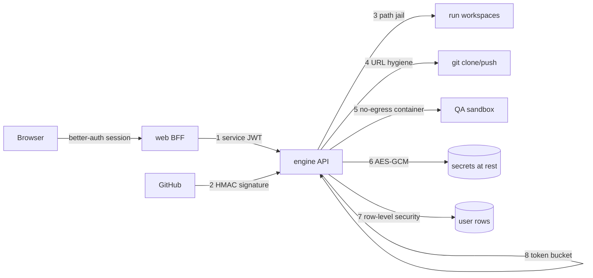

# Security-Boundary Audit

**Date:** 2026-07-15 · Phase 7, closing slice of the planned workstreams.
Method: walk every boundary the platform claims to hold, verify the claim in
the code and tests, and record a verdict with evidence. Findings that could
be fixed inline were fixed in the same change; the rest are logged in
[BACKLOG.md](../BACKLOG.md).

## The boundary map

## Boundary by boundary

| # | Boundary | Claim | Evidence | Verdict |
|---|---|---|---|---|
| 1 | Service JWT | Every `/v1/*` route requires the BFF-signed HS256 token (`exp` + `sub` enforced); `/healthz` is the only public route | `engine/auth.py` (`options={"require": ["exp", "sub"]}`); expiry/garbage/wrong-secret cases in `tests/test_auth.py` | **Holds** — and was made structural (finding 1) |
| 2 | Webhook signature | GitHub's calls are authenticated by `X-Hub-Signature-256`; no secret configured means every call refused | `engine/github.py:44` — fail-closed on empty secret or missing header, constant-time `hmac.compare_digest` | **Holds** |
| 3 | Workspace path jail | An agent (or the run-page file browser/editor) can only touch files inside its own workspace | `engine/workspace/jail.py` — rejects null bytes, absolute paths, Windows drives/UNC, and symlink escapes under *both* OS path rules; `resolve()` before the containment check | **Holds** |
| 4 | Clone/push URL hygiene | User-controlled repository URLs cannot become code execution or leak tokens | `engine/workspace/manager.py:40` — only `https://` or existing local paths reach `git clone`, always after `--`; push errors scrub the GitHub token before logs/UI (`manager.py:143`) | **Holds** |
| 5 | Sandbox isolation | Agent-written code runs its tests with no network, bounded memory/CPU, on a *copy* of the workspace | `engine/sandbox/runner.py` — `docker network disconnect` before the test phase, `--memory`/`--cpus` flags, copy-not-mount; install phase runs with network on **by design** (package downloads) | **Holds** (accepted: install phase is online) |
| 6 | Secrets at rest | BYO provider keys and integration configs are ciphertext in the database; the API never returns a stored secret | `engine/security/crypto.py` — AES-GCM, random nonce, authenticated; `api/provider_keys.py` returns `last4` only | **Holds**, with finding 2 on the dev key fallback |
| 7 | Row-level security | Postgres refuses a pinned session another user's rows; the engine role is NOSUPERUSER | audited in its own slice — [ROW_LEVEL_SECURITY.md](../architecture/ROW_LEVEL_SECURITY.md); suite runs under FORCE RLS; superuser fails the suite loudly | **Holds** (2026-07-17: deny-by-default closed the unset-context boundary; a non-owner API role remains logged) |
| 8 | Rate limiting | Per-caller token bucket keyed by the *verified* JWT subject, IP fallback, 429 + `Retry-After` | `engine/ratelimit.py`; off by default | **Holds** (known: per-replica buckets — logged) |
| 9 | PR gates | The secrets scanner and dependency scanner block a run's pull request | Phase 3 exit criteria; `engine/security/secrets_scanner.py`, `dependency_scanner.py` and their tests | **Holds** |
| 10 | CORS | Only configured origins may call the engine from a browser context | `engine/main.py` — explicit `ENGINE_CORS_ORIGINS` list, no wildcard | **Holds** (defence in depth — browsers shouldn't reach the engine at all) |

## Findings

1. **Auth was per-route convention, not a structural guarantee** *(fixed in
   this change)*. Every route carries `Depends(require_service_auth)` by
   hand — nothing stopped a future route from forgetting it.
   `tests/test_route_auth_sweep.py` now walks the real route table and calls
   every endpoint unauthenticated; anything that fails to 401 fails the
   suite. The hole class is closed permanently, not just audited once.
2. **The encryption key silently falls back to a derived dev key** *(fixed
   2026-07-15)*. With `ENGINE_ENCRYPTION_KEY` unset, secrets at rest are
   encrypted with a key derived from `ENGINE_SERVICE_SECRET` — right for the
   dev loop, wrong for production, where one leaked secret would compromise
   both transport auth *and* stored secrets. Both process startups (API
   lifespan and worker) now call `warn_if_derived_key()`
   (`engine/security/crypto.py`), which logs a loud warning naming the fix.
3. **The webhook receiver had no replay/dedupe guard** *(fixed 2026-07-15)*.
   A GitHub redelivery re-reviewed the same PR — wasted tokens and duplicate
   comments, not a breach; the signature check still gates every delivery.
   The receiver now remembers queued `X-GitHub-Delivery` ids (bounded,
   in-process) and ignores a repeat. A replica restart forgets and at worst
   re-reviews once — HMAC remains the security boundary, this is hygiene.

## Accepted boundaries (documented, not defects)

- Sandbox dependency-install phase runs with the network on; tests run with
  it off (the design's stated contract).
- ~~Unset RLS context is the trusted internal path~~ — **closed 2026-07-17**:
  the policies now deny a context-free session outright; internal paths
  assert an explicit `app.service` context via `session_scope()`
  ([ROW_LEVEL_SECURITY.md](../architecture/ROW_LEVEL_SECURITY.md)). The
  remaining, narrower boundary: a database attacker who can run arbitrary
  SQL can set the flag themselves — a separate non-owner API role stays on
  the backlog.
- Rate-limit buckets are per replica until the Redis-backed shared window.
- BFF→engine mTLS/NetworkPolicy waits for a real cluster rollout (ADR-0002
  debt, logged).

## Out of scope

better-auth's own session handling (upstream library), the web app's client
code, and infrastructure beyond the Helm chart (ingress TLS, cluster
policies) — those belong to the operator rollout.
